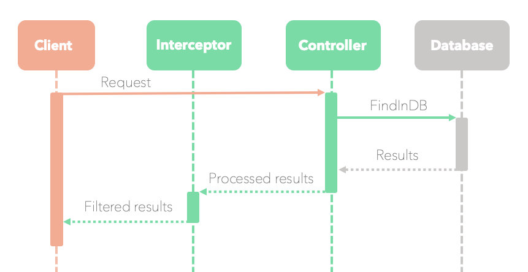

# Intercepting Filter Design Pattern

This document gives a high-level overview of the **Intercepting Filter Design Pattern** and its usage. 

For a **practical introduction**, there is also a `NestJS` and `Prisma` **tutorial** ready for you in the [Tutorial: Interceptor on NestJS and Prisma](#tutorial-interceptor-on-nestjs-and-prisma) section.


## Contents

- [Introduction](#introduction)
- [What is the Intercepting Filter Design Pattern?](#what-is-the-intercepting-filter-design-pattern)
- [Benefits of its usage](#benefits-of-its-usage)
- [When to use it](#when-to-use-it)
- [Tutorial: Interceptor on NestJS and Prisma](#tutorial-interceptor-on-nestjs-and-prisma)
- [Prerequisites](#prerequisites)
- [Getting started](#getting-started)
- [Next steps](#next-steps)

## Introduction

The most evident marker of an app’s success is its functionality. Apps intend to make things simple for their users.

Similarly, software development benefits from using [Software Design Patterns](https://en.wikipedia.org/wiki/Software_design_pattern). They simplify the approach for developers and speed up the development process. They are language agnostic templates that are proven to work for their intended use. 

When implemented correctly, the code will likely be easier to read, improving knowledge transfer between developers. 

## What is the Intercepting Filter Design Pattern?

The **Intercepting Filter Design Pattern** outlines how to extend or filter data during the software processing cycle. It works by adding a processing step – often called *filter* or *interceptor* – before/after incoming requests or outgoing responses. 

We can implement this pattern in different frameworks or languages. It is also a form of [Aspect-Oriented Programming](https://docs.microsoft.com/en-us/archive/msdn-magazine/2002/march/aop-aspect-oriented-programming-enables-better-code-encapsulation-and-reuse) because its design aims for modularity and separation of concerns. 

This sequence diagram shows a simulated flow of the request when using the **Intercepting Filter Design Pattern**:


> **_NOTE:_**  The diagram only depicts high level object interactions. It does not include how the object is affected by services or modules.

## Benefits of its usage

Using this pattern makes it possible to change a request/response without altering their core code. It also improves code modularity and maintainability. 

You can find more benefits of using Design Patterns in the [5 Reasons to finally learn Design Patterns](https://www.oreilly.com/content/5-reasons-to-finally-learn-design-patterns/) website.

## When to use it

Some examples of its usage are: 
- Adding `_next` and `_before` pagination references in an API response.
- Changing a property in the request to comply with a standard. 
- Altering a response property to meet the requirements of an external entity.
- Augmenting an API response with the caller endpoint, response object type, and the total number of items returned from a query. **The following tutorial will explore this example**.

## Tutorial: Interceptor on `NestJS` and `Prisma`

This **tutorial** shows how to implement the **Intercepting Filter Design Pattern** in `NestJS` by using the `UseInterceptor` decorator. 

You will work with the following stack:

- [**NestJS**](https://docs.nestjs.com/): `Node.js` framework.
- [**Prisma Client**](https://www.prisma.io/docs/concepts/components/prisma-client): Database ORM.                  
- [**Prisma Migrate**](https://www.prisma.io/docs/concepts/components/prisma-migrate): Database migrations.   
- [**SQLite**](https://www.sqlite.org/index.html): Local, file-based SQL database.

At the of this tutorial, you will have a products API with three methods: `create`, `findOne` and `findMany`. The products API will use `Prisma` to create and connect to a local database.

The aim is to intercept the response from `Prisma` and wrap it into a custom object. 

The wrapper will:
-	Use `datum` or `data` depending on the type of response.
-	Have a `_count` property for a multiple items response.
-	Have a `_self` property with the queried endpoint segment.

### How should the response look like?

<table>
<tr>
<td> Get many products </td> <td> Get single product </td>
</tr>
<tr>
<td>

```json
{
  "data": [
    {
      "id": 1,
      "name": "Goku Plush Toy",
      "price": 29.99,
      "description": "Goku Plush figure..."
    },
    {
      "id": 2,
      "name": "Piccolo Plush Toy",
      "price": 19.99,
      "description": "Piccolo Plush figure..." 
    },
    ],
    "_self": "/products",
    "_count": 2
}
```
</td>
<td>

```json
{
    "datum": {
        "id": 1,
        "name": "Goku Plush Toy",
        "price": 29.99,
        "description": "Goku Plush figure..."
    },
    "_self": "/products/1"
}
```

</td>
</tr>
</table>

## Prerequisites

This tutorial assumes you have a working copy of `NestJS` with `Prisma`. Medium level knowledge in those technologies is recommended but not essential.

You can use the [NestJS Prisma starter kit](https://github.com/fivethree-team/nestjs-prisma-starter) to get everything up and running quickly.

<details><summary>Alternatively, you can <strong>follow these steps</strong> to gain more exposure to the technology stack.</summary>

### 1. Install `NestJS CLI` and create your application 

Run the following commands in your console:

```
npm i -g @nestjs/cli
nest new nestjs-prisma-tutorial
```

> **_NOTE:_**  Visit the [NestJS First Steps Guide](https://docs.nestjs.com/first-steps) for more information about the `NestJS` installation process.

### 2. Install `Prisma` and `Prisma Client`

Run the following commands:

```
npm add @prisma/client && npm install prisma --save-dev
cd src && npx prisma init
```

### 3. Start your `NestJS` application:

Run:

```
npm start
```

Well done! Now you can navigate to `http://localhost:3000` in your browser to explore your `NestJS` application. 
  
If you see the text: *Hello World!*, give yourself a pat on the back! your NestJS application is working. 
</details>

## Getting started

### 1. Create the `Product` model in your schema

It’s time to execute your first migration. You can follow the steps in the [Prisma Docs](https://www.prisma.io/docs/concepts/components/prisma-migrate).

This tutorial uses a local `SQLite`, file-based database. **Pay special attention to this**, and remember this code isn’t production-ready.

The file should look like this:

```typescript:title=src/prisma/schema.prisma
// This is your Prisma schema file,
// learn more about it in the docs: https://pris.ly/d/prisma-schema

datasource db {
  provider = "sqlite"
  url      = "file:./dev.db"
}

generator client {
  provider = "prisma-client-js"
}

model Product {
    id Int @default(autoincrement()) @id
    name String
    price Float
    description String
}

```

### 2. Create the `Prisma` module and controller

After updating your schema, you will need to generate the `Prisma` module and controller.

Run the following command in your console: 
```
nest g module prisma && nest g service prisma
```

### 3. Create the `Product DTO`

Creating a `DTO (Data Transfer Object)` will help you ensure the structure remains tidy moving forward.

> **_NOTE:_**  If you want to know more about `DTOs`, [Martin Fowler's page](https://martinfowler.com/eaaCatalog/dataTransferObject.html) has extensive information about the topic.

The `Product DTO` will be the object carrying the product data. 

The file should look like this:
```typescript:title=src/products/product.dto.ts
export class ProductDto {
    id: number;
    name: string;
    price: number;
    description: string;
}
```

### 4. Create the `Product` controller

Everything looks great. Amazing work! 

Now it’s time to create a controller for your products.

```typescript:title=src/products/products.controller.ts
import { Body, Controller, Get, Param, ParseIntPipe, Post, UseInterceptors } from '@nestjs/common';
import { PrismaService } from '../prisma/prisma.service';
import { ProductDto } from './product.dto';
import { ApiDataInterceptor, ApiDatumInterceptor } from '../api-responses/api-responses.interceptor';

@Controller('products')
export class ProductsController {
  constructor(private readonly prismaService: PrismaService) {}

  @Get()
  @UseInterceptors(ApiDataInterceptor)
  findAll(): Promise<ProductDto[]> {
    return this.prismaService.product.findMany();
  }

  @Get('/:id')
  @UseInterceptors(ApiDatumInterceptor)
  findById(@Param('id', ParseIntPipe) id: number): Promise<ProductDto> {
    return this.prismaService.product.findUnique({
      where: { id },
    });
  }

  @Post()
  create(
    @Body() { name, price, description }: ProductDto,
  ): Promise<ProductDto> {
    return this.prismaService.product.create({ data: { name, price, description }});
  }
}
```
### 5. Create the `Product` module

With the `Products` controller in place, it's time to create the module for your endpoint. 

The file should look like this:

```typescript:title=src/products/products.module.ts
import { Module } from '@nestjs/common';
import { ProductsController } from './products.controller';
import { PrismaModule } from '../prisma/prisma.module';
import { PrismaService } from '../prisma/prisma.service';

@Module({
  imports: [PrismaModule],
  controllers: [ProductsController],
  providers: [PrismaService]
})
export class ProductsModule {}
```
### 6.	Add the `ProductsModule` to the `app.module.ts`

```typescript:title=src/app.module.ts
import { Module } from '@nestjs/common';
import { AppController } from './app.controller';
import { AppService } from './app.service';
import { PrismaModule } from './prisma/prisma.module';
import { ProductsModule } from './products/products.module';

@Module({
  imports: [PrismaModule, ProductsModule],
  controllers: [AppController],
  providers: [AppService],
})
export class AppModule {}

```
### 7.	Build the `api-responses` interceptor

This is where the fun starts. You will need an interceptor responsible for altering the response. The interceptor will live in a new folder called `api-responses`.

#### 7.1.	Create the `Data DTO` and `Datum DTO`

After creating the `api-responses` folder, you will need a `DTO` for your two different types of responses:
-	`Data`: Used for requests that return multiple products. This will include a count with the number of products retrieved.
-	`Datum`: Used for requests that return a single product.

The file should look like this:

```typescript:title=src/api-responses/api-responses.dto.ts
export class DataResponseDto<T> {
  data: T[];
  _count: number;
  _self: string;
}

export class DatumResponseDto<T> {
  datum: T;
  _self: string;
}
```
#### 7.2.	Create the `api-responses` interceptor

The interceptor will use the `DTO` and return the augmented response.

```typescript:title=src/api-responses/api-responses.interceptor.ts
import { Injectable, NestInterceptor, ExecutionContext, CallHandler } from "@nestjs/common";
import { DataResponseDto, DatumResponseDto } from "./api-responses.dto";
import { Observable } from "rxjs";
import {Request } from "express";
import { map } from "rxjs/operators";

@Injectable()
export class ApiDataInterceptor<T> implements NestInterceptor<T, DataResponseDto<T>> {   
    intercept(context: ExecutionContext, next: CallHandler): Observable<DataResponseDto<T>> {
        const req: Request = context.switchToHttp().getRequest();

        return next.handle().pipe(map(data => <DataResponseDto<T>> {
            data,
            _self: req.originalUrl,
            _count: data.length
        }));
    }
}

@Injectable()
export class ApiDatumInterceptor<T> implements NestInterceptor<T, DatumResponseDto<T>> {
    intercept(context: ExecutionContext, next: CallHandler): Observable<DatumResponseDto<T>> {
        const req: Request = context.switchToHttp().getRequest();

        return next.handle().pipe(map(datum => <DatumResponseDto<T>> {
            datum,
            _self: req.originalUrl,
        }));
    }
}
```
### 8.	Apply the interceptor in the `Products` controller using decorators

The final touch is to import and use the interceptors from `api-responses` in your `Products` controller:

```diff typescript:title=src/products/products.controller.ts
- import { Body, Controller, Get, Param, ParseIntPipe, Post } from '@nestjs/common';
+ import { Body, Controller, Get, Param, ParseIntPipe, Post, UseInterceptors } from '@nestjs/common';

import { PrismaService } from '../prisma/prisma.service';
import { ProductDto } from './product.dto';
+ import { ApiDataInterceptor, ApiDatumInterceptor } from '../api-responses/api-responses.interceptor';

@Controller('products')
export class ProductsController {
  constructor(private readonly prismaService: PrismaService) {}

  @Get()
+  @UseInterceptors(ApiDataInterceptor)
  findAll(): Promise<ProductDto[]> {
    return this.prismaService.product.findMany();
  }

  @Get('/:id')
+  @UseInterceptors(ApiDatumInterceptor)
  findById(@Param('id', ParseIntPipe) id: number): Promise<ProductDto> {
    return this.prismaService.product.findUnique({
      where: { id },
    });
  }

  @Post()
  create(
    @Body() { name, price, description }: ProductDto,
  ): Promise<ProductDto> {
    return this.prismaService.product.create({ data: { name, price, description }});
  }
}
```

### 9.	Test your application

Well done! By now your interceptor should be working perfectly.

You can make requests to your API using [Postman](https://www.postman.com/), [Insomnia](https://insomnia.rest/), your console, or any other API request platform to test endpoints.

This is an example of what you can do:

1. Make a **POST** request to `localhost:3000/products` with this body:
```json
{
    "name": "Goku Plush Toy",
    "description": "Goku Plush figure. Original and licensed.",
    "price": 29.99
}
```

2. Make a **GET** request to `localhost:3000/products` and it should respond with:
```json
{
    "data": [
        {
            "id": 1,
            "name": "Goku Plush Toy",
            "price": 29.99,
            "description": "Goku Plush figure. Original and licensed."
        }
    ],
    "_self": "/products",
    "_count": 2
}
```

## Next steps

- Read more about [Interceptors in NestJS](https://docs.nestjs.com/interceptors).
- Read more about **Software Design Patterns** in [The Catalog of Patterns of Enterprise Application Architecture](https://martinfowler.com/eaaCatalog/) website by Martin Fowler.

